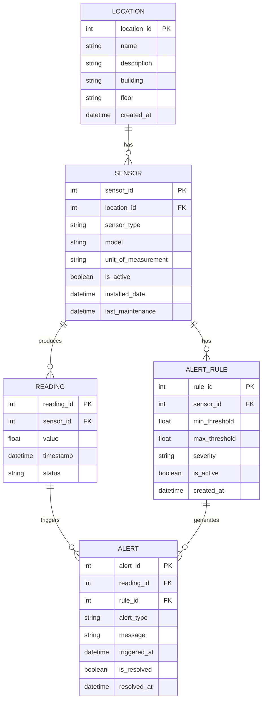

# Environmental Monitoring System - ER Diagram

## Mermaid ER Diagram

## Entity Descriptions

### 1. **LOCATION**
Represents physical locations where sensors are deployed
- `location_id`: Primary key
- `name`: Location name (e.g., "Living Room", "Bedroom")
- `description`: Additional details about the location
- `building`: Building identifier
- `floor`: Floor level
- `created_at`: When location was added to system

### 2. **SENSOR**
Physical sensor devices connected to the Raspberry Pi
- `sensor_id`: Primary key
- `location_id`: Foreign key to LOCATION
- `sensor_type`: Type (e.g., "temperature", "humidity", "light")
- `model`: Sensor model (e.g., "DHT22")
- `unit_of_measurement`: Unit (e.g., "°C", "%", "lux")
- `is_active`: Whether sensor is currently active
- `installed_date`: Installation date
- `last_maintenance`: Last maintenance check

### 3. **READING**
Individual measurements taken by sensors
- `reading_id`: Primary key
- `sensor_id`: Foreign key to SENSOR
- `value`: Measured value
- `timestamp`: When reading was taken
- `status`: Reading status (e.g., "normal", "error", "calibration")

### 4. **ALERT_RULE**
Configured thresholds for generating alerts
- `rule_id`: Primary key
- `sensor_id`: Foreign key to SENSOR
- `min_threshold`: Minimum acceptable value
- `max_threshold`: Maximum acceptable value
- `severity`: Alert severity (e.g., "warning", "critical")
- `is_active`: Whether rule is currently active
- `created_at`: When rule was created

### 5. **ALERT**
Triggered alerts when readings violate rules
- `alert_id`: Primary key
- `reading_id`: Foreign key to READING
- `rule_id`: Foreign key to ALERT_RULE
- `alert_type`: Type (e.g., "high_temperature", "low_humidity")
- `message`: Human-readable alert message
- `triggered_at`: When alert was triggered
- `is_resolved`: Whether alert has been addressed
- `resolved_at`: When alert was resolved

## Relationships

1. **LOCATION to SENSOR** (1:N)
   - One location can have multiple sensors
   - Each sensor belongs to one location

2. **SENSOR to READING** (1:N)
   - One sensor produces many readings over time
   - Each reading comes from one sensor

3. **SENSOR to ALERT_RULE** (1:N)
   - One sensor can have multiple alert rules
   - Each rule applies to one sensor

4. **READING to ALERT** (1:N)
   - One reading can trigger multiple alerts (if violating multiple rules)
   - Each alert is triggered by one reading

5. **ALERT_RULE to ALERT** (1:N)
   - One rule can generate many alerts over time
   - Each alert is based on one rule

## Sample Data Examples

### Locations
- Living Room (Building A, Ground Floor)
- Bedroom (Building A, First Floor)
- Greenhouse (Outdoor)

### Sensors
- DHT22 Temperature Sensor (Living Room, measuring °C)
- DHT22 Humidity Sensor (Living Room, measuring %)
- DHT22 Temperature Sensor (Bedroom, measuring °C)

### Readings
- Sensor 1: 22.5°C at 2024-03-08 14:30:00
- Sensor 2: 65% at 2024-03-08 14:30:00
- Sensor 3: 19.8°C at 2024-03-08 14:30:15

### Alert Rules
- Temperature > 30°C → Critical Alert
- Temperature < 15°C → Warning Alert
- Humidity > 70% → Warning Alert
- Humidity < 30% → Warning Alert
